# 🩺 BioSignal Multi-Viewer Platform

<!-- PROJECT BANNER -->

<!-- TODO: Replace with an actual screenshot/banner of the application -->

A **Flask-based web application** that brings together **four signal processing & visualization modules** in one unified interface. Built for biomedical engineering coursework (**SBEG205 — Spring 2026, Team 15**).


---

## 📋 Table of Contents

- [Demo Screenshots](#-demo-screenshots)
- [Modules Overview](#-modules-overview)
- [Tech Stack](#-tech-stack)
- [Installation](#-installation)
- [Running the App](#-running-the-app)
- [Project Structure](#-project-structure)
- [Modules in Detail](#-modules-in-detail)
  - [Medical Signal Viewer](#-1-medical-signal-viewer--)
  - [Stock Market Dashboard](#-2-stock-market-dashboard--)
  - [Acoustic Signal Lab](#-3-acoustic-signal-processing-lab--)
  - [Microbiome Signals](#-4-microbiome-signals--)
- [API Reference](#-api-reference)
- [Sample Data](#-sample-data)
- [Team](#-team)
- [License](#-license)

---

## 📸 Demo Screenshots

<!-- 
  ⚠️ PHOTO PLACEHOLDERS — Replace the paths below with your actual screenshots.
  Recommended: create a `screenshots/` folder in the repo root and place images there.
-->

### Home Page — Medical Signal Viewer
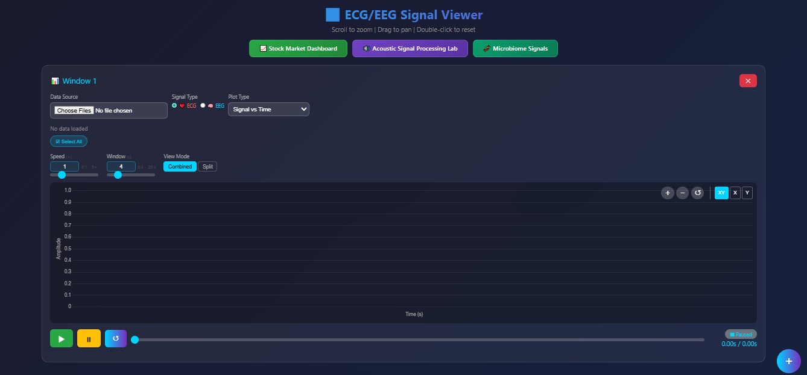

### ECG Signal Loaded with Multi-Channel View
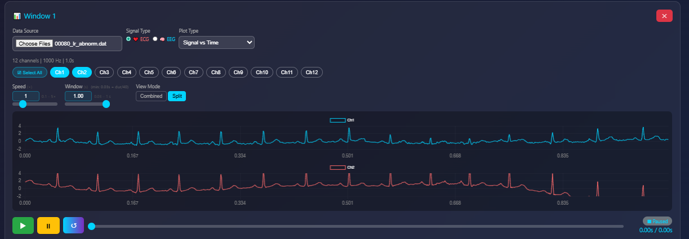

### AI & ML Classification Results
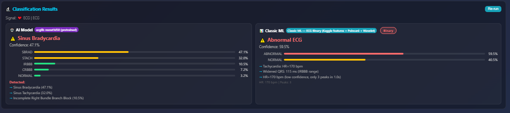

### Stock Market Dashboard
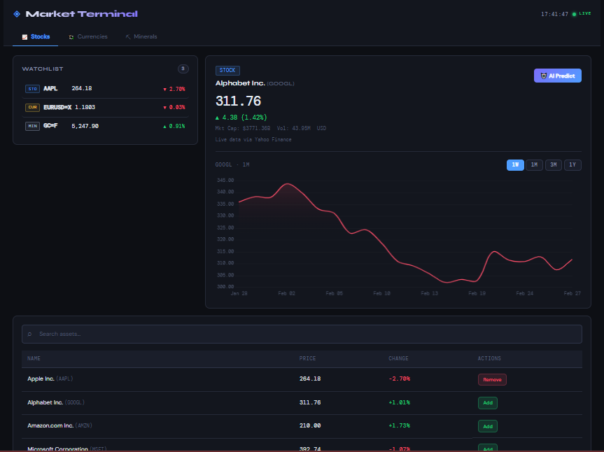

### Acoustic Signal Processing Lab
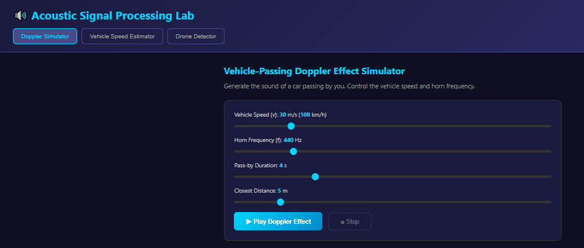

### Doppler Effect Simulator
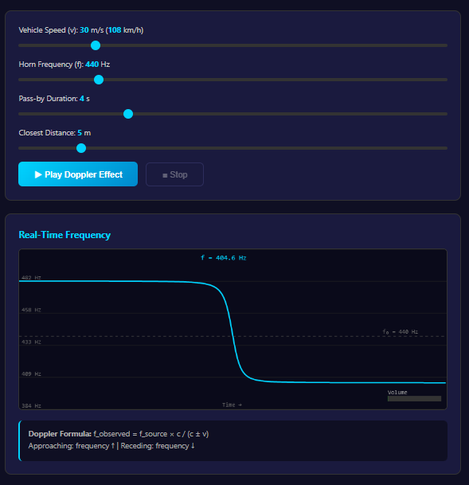

### Vehicle Speed Estimator
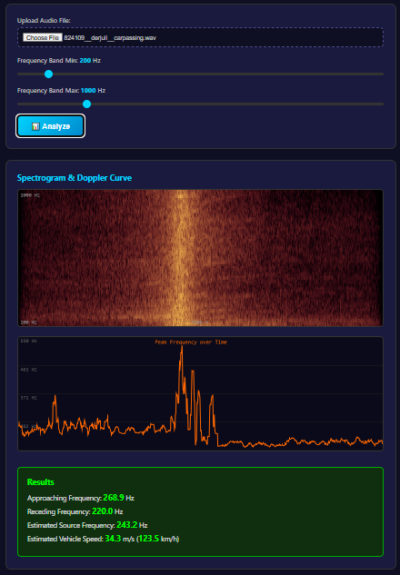

### Drone Sound Detector
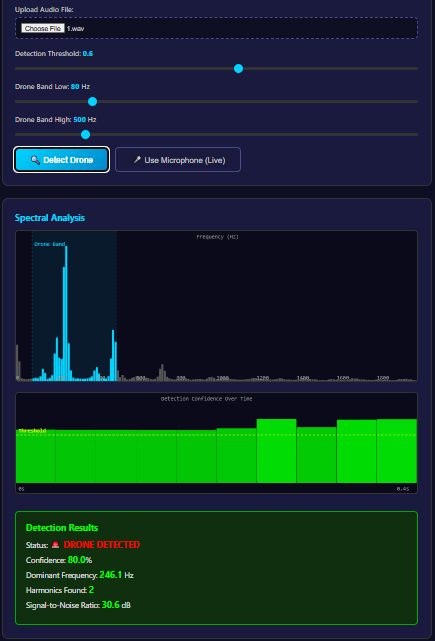

### Microbiome Signals Dashboard
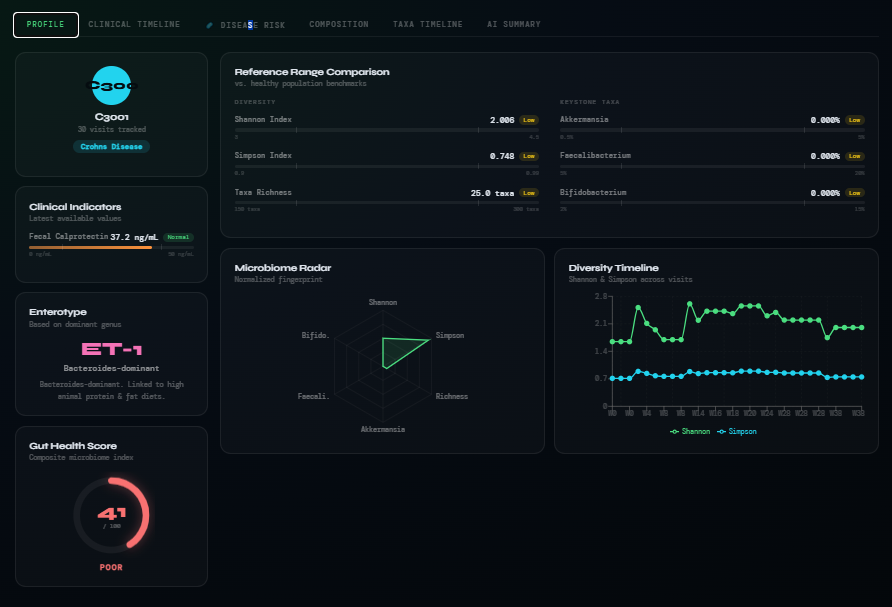

### Patient Risk Profiler
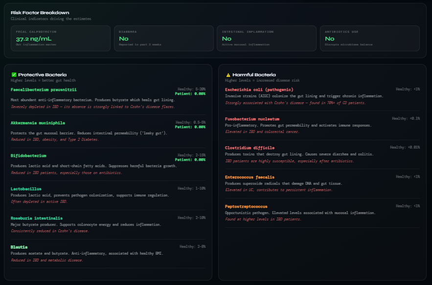

### Patient Taxa_Timeline
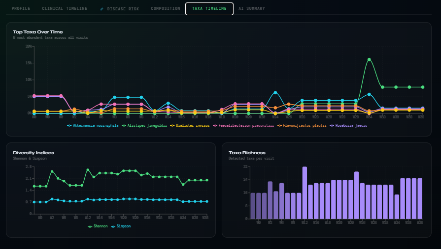

---

## 🧩 Modules Overview

| Module | Route | Description |
|--------|-------|-------------|
| 📊 **Medical Signal Viewer** | `/` | ECG/EEG signal viewer with AI & ML classification |
| 📈 **Stock Market Dashboard** | `/stock-dashboard` | Real-time stock quotes, watchlist & price charts |
| 🔊 **Acoustic Signal Lab** | `/acoustic-lab` | Doppler simulator, vehicle speed estimator & drone detector |
| 🧬 **Microbiome Signals** | `/microbiome` | Gut microbiome abundance profiling & patient risk estimation |

---

## 🛠 Tech Stack

| Layer | Technologies |
|-------|-------------|
| **Backend** | Python 3, Flask, NumPy, Pandas, PyEDFLib, WFDB, yfinance |
| **Frontend** | HTML5, CSS3, JavaScript (ES6+), Chart.js, Plotly.js, PapaParse |
| **AI/ML Models** | PyTorch (ECGNet via ecglib, EEGNet via Braindecode), scikit-learn–style classic ML detectors |
| **External APIs** | Yahoo Finance (yfinance), Google Gemini (microbiome AI summaries) |

---

## ⚙ Installation

### Prerequisites
- Python 3.9+
- pip (Python package manager)
- A modern web browser (Chrome, Firefox, Edge)

### Steps

1. **Clone the repository:**
   ```bash
   git clone https://github.com/MohamedSayed-2005/signal-viewer.git
   cd signal-viewer/task01-signal-viewer-sbeg205_spring26_team15-main
   ```

2. **Create a virtual environment (recommended):**
   ```bash
   python -m venv venv

   # Windows
   venv\Scripts\activate

   # macOS / Linux
   source venv/bin/activate
   ```

3. **Install dependencies:**
   ```bash
   pip install flask numpy pandas pyedflib wfdb yfinance torch ecglib braindecode python-dotenv
   ```

4. **Set up environment variables (optional — for Microbiome AI summaries):**
   Create a `.env` file in the project root:
   ```
   GEMINI_API_KEY=your_google_gemini_api_key_here
   ```

---

## 🚀 Running the App

```bash
python app.py
```

Then open **http://localhost:5000** in your browser.

Navigate between modules using the buttons on the home page or visit the routes directly:

| Module | URL |
|--------|-----|
| Medical Signal Viewer | `http://localhost:5000/` |
| Stock Dashboard | `http://localhost:5000/stock-dashboard` |
| Acoustic Lab | `http://localhost:5000/acoustic-lab` |
| Microbiome Signals | `http://localhost:5000/microbiome` |

---

## 📁 Project Structure

```
signal-viewer/
│
├── data/                          # Additional data files
│
└── task01-signal-viewer-sbeg205_spring26_team15-main/
    │
    ├─�� .env                       # Environment variables (GEMINI_API_KEY)
    ├── app.py                     # 🏠 Flask server — all routes & API endpoints
    ├── requirements.txt           # Python dependencies
    ├── README.md                  # Project documentation
    │
    ├── 00052_lr_IRBBB.dat        # Sample ECG data (PhysioNet WFDB format)
    ├── 00077_lr_IRBBB.dat        # Sample ECG data (PhysioNet WFDB format)
    ├── 00080_lr_norm.dat          # Sample ECG data (normal)
    ├── Subject05_2norm.edf        # Sample EEG data (EDF format)
    │
    ├── models/                    # 🧠 AI & Classic ML classifiers
    │   ├── __init__.py            # Package initializer
    │   ├── ecg_classifier.py      # ECGNet (ResNet1D50) — 4 pathology models
    │   ├── eeg_classifier.py      # EEGNet (Braindecode) classifier
    │   ├── ml_detector.py         # Classic ML feature-based detection (ECG & EEG)
    │   ├── models_ml_detector.py  # ML detector model definitions
    │   ├── predict.py             # Prediction blueprint & utilities
    │   ├── train_model.py         # Model training script
    │   ├── ecgnet_weights.pt      # 🏋️ Pretrained ECG model weights
    │   └── eegnet_weights.pt      # 🏋️ Pretrained EEG model weights
    │
    ├── templates/                 # 📄 HTML pages (Jinja2 templates)
    │   ├── index.html             # Medical Signal Viewer (main page)
    │   ├── stock-dashboard.html   # Stock Market Dashboard
    │   ├── acoustic-lab.html      # Acoustic Signal Processing Lab
    │   └── microbiome.html        # Microbiome Signals (React app wrapper)
    │
    ├── static/                    # 🎨 Static assets
    │   ├── css/                   # Stylesheets
    │   │   └── ...                # CSS files for styling each module
    │   ├── data/                  # Static data files
    │   │   └── ...                # Microbiome CSV data, etc.
    │   ├── js/                    # JavaScript modules
    │   │   ├── script.js              # Stock dashboard logic
    │   │   ├── fft.js                 # FFT implementation
    │   │   ├── doppler-simulator.js   # Doppler effect audio synthesis
    │   │   ├── doppler-analyzer.js    # Vehicle speed estimation from audio
    │   │   ├── drone-detector.js      # Drone sound detection via spectral analysis
    │   │   ├── dataLoader.js          # CSV parser for microbiome data
    │   │   ├── charts.js              # Microbiome chart renderers
    │   │   ├── patientProfiler.js     # Patient risk profiler
    │   │   └── microbiome-app.js      # Microbiome page controller
    │   └── microbiome/            # Microbiome React build (Vite)
    │       ├── index.html         # React app entry point
    │       ├── vite.svg           # Vite logo asset
    │       └── assets/            # Compiled JS/CSS bundles
    │
    ├── microbiome-ui/             # Microbiome React source code (Vite project)
    │   └── ...                    # React components, source files
    │
    └── utils/                     # 🔧 Utility modules
        └── ...                    # Helper functions & shared utilities
```

---

## 🔍 Modules in Detail

### 📊 1. Medical Signal Viewer — `/`


<!-- TODO: Add screenshot showing the signal viewer with controls -->

The core module. Upload ECG or EEG signals and explore them interactively.

**Supported file formats:**
| Format | Description |
|--------|-------------|
| `.csv` | Comma-separated values with optional time column |
| `.edf` | European Data Format (standard for EEG) |
| `.dat` | PhysioNet WFDB format (with optional `.hea` header) |

**Features:**
- 🪟 **Multi-window support** — open multiple signal viewers side-by-side
- 📈 **Plot types:** Signal vs Time, XOR Graph, Channel vs Channel (Lissajous), Polar Plot, Polar Ratio, Recurrence Plot
- 🔀 **View modes:** Combined (overlaid) or Split (one chart per channel)
- 🎮 **Interactive controls:** Play/pause animation, zoom (scroll), pan (drag), double-click to reset, speed & window size sliders
- 🎨 **Per-channel customization:** Color picker, line width, visibility toggle
- 🤖 **AI Classification:** Deep learning models (ECGNet ResNet1D50 for ECG, EEGNet for EEG) predict pathologies with probability bars
- 📐 **Classic ML Classification:** Feature-based detectors (HRV analysis, spectral features, statistical metrics) for comparison
- 🔍 **Auto-detection:** Automatically detects ECG vs EEG based on channel names

---

### 📈 2. Stock Market Dashboard — `/stock-dashboard`


<!-- TODO: Add screenshot showing watchlist and price chart -->

Real-time stock market data powered by **yfinance** (Yahoo Finance).

**Features:**
- 🔎 **Search & Watchlist** — search for any stock ticker, add to your watchlist
- 💰 **Live Quotes** — current price, change, change %, with color-coded indicators
- ⚡ **Bulk Quotes** — fetch up to 50 symbols in a single request
- 📊 **Price Charts** — interactive historical charts with timeframes: 1W, 1M, 3M, 6M, 1Y, 2Y, 5Y

---

### 🔊 3. Acoustic Signal Processing Lab — `/acoustic-lab`

Three sub-modules for acoustic signal analysis:

#### 🚗 Doppler Effect Simulator


<!-- TODO: Add screenshot of the Doppler simulator in action -->

Generate realistic vehicle-passing sounds using the Doppler formula.

**Adjustable Parameters:**
- Vehicle speed (5–150 m/s)
- Horn frequency (100–2000 Hz)
- Pass-by duration & closest distance
- Real-time frequency visualization on canvas

#### 📊 Vehicle Speed Estimator


<!-- TODO: Add screenshot of the spectrogram and speed estimation -->

Upload a `.wav` or `.mp3` recording of a vehicle passing by to:
- Generate a spectrogram via FFT
- Extract the Doppler frequency curve
- Estimate the vehicle's speed and horn frequency
- Configurable frequency band (min/max)

#### 🛸 Drone Sound Detector


<!-- TODO: Add screenshot of the drone detection results -->

Upload audio or use your **live microphone** to detect drone presence:
- Spectral analysis targeting rotor harmonics (80–500 Hz)
- Detection confidence score
- Dominant frequency & harmonic identification
- Signal-to-Noise Ratio (SNR) measurement
- Adjustable detection threshold and frequency band

---

### 🧬 4. Microbiome Signals — `/microbiome`


<!-- TODO: Add screenshot of the microbiome dashboard with charts -->

Visualize gut microbiome abundance data and estimate patient health profiles.

**How to use:** Upload a CSV file containing microbiome data (or use the provided sample dataset).

**Expected CSV columns:**
```
SampleID, PatientID, Age, Sex, BMI, BodySite, Diagnosis,
Bacteroides, Firmicutes, Proteobacteria, Actinobacteria,
Fusobacteria, Verrucomicrobia, Tenericutes, Cyanobacteria,
Spirochaetes, Synergistetes
```

**Visualizations:**
| Chart | Description |
|-------|-------------|
| 📊 **Abundance Bar Chart** | Bacterial abundances per sample |
| 🗺️ **Heatmap** | Samples × bacteria abundance matrix |
| 🥧 **Composition Pie** | Relative bacterial composition |
| 📈 **Diversity Plot** | Shannon diversity across samples |

**Patient Profile Estimator:**
Select a patient from the dropdown to see:
- Disease risk assessment based on microbiome signature
- Known microbiome–disease associations (IBD, T2D, Obesity, CRC)
- Comparison of patient's profile against the population
- AI-powered summary via Google Gemini API

---

## 📡 API Reference

### Signal Viewer APIs

| Method | Endpoint | Description |
|--------|----------|-------------|
| `POST` | `/api/upload` | Upload signal files (`.csv`, `.edf`, `.dat`) |
| `GET` | `/api/all_data?window_id=0` | Retrieve loaded signal data for a window |
| `GET` | `/api/classify?window_id=0` | Run AI + ML classification |
| `GET` | `/api/set_signal_type?window_id=0&signal_type=ecg` | Override auto-detected signal type |

### Stock Market APIs

| Method | Endpoint | Description |
|--------|----------|-------------|
| `GET` | `/api/stocks/quote?symbol=AAPL` | Single real-time stock quote |
| `GET` | `/api/stocks/bulk?symbols=AAPL,MSFT,TSLA` | Bulk quotes (up to 50 symbols) |
| `GET` | `/api/stocks/history?symbol=AAPL&period=1mo` | Historical price data for charting |

**Supported history periods:** `5d`, `1mo`, `3mo`, `6mo`, `1y`, `2y`, `5y`

### Microbiome APIs

| Method | Endpoint | Description |
|--------|----------|-------------|
| `POST` | `/api/microbiome/summary` | AI summary via Gemini (requires `GEMINI_API_KEY`) |

---

## 📦 Sample Data

The repository includes sample biomedical signal files for testing:

| File | Format | Type | Description |
|------|--------|------|-------------|
| `00052_lr_IRBBB.dat` | WFDB (.dat) | ECG | Incomplete Right Bundle Branch Block |
| `00077_lr_IRBBB.dat` | WFDB (.dat) | ECG | Incomplete Right Bundle Branch Block |
| `00080_lr_norm.dat` | WFDB (.dat) | ECG | Normal ECG recording |
| `Subject05_2norm.edf` | EDF | EEG | Normal EEG recording |

---

## 👥 Team

**Team 15** — SBEG205, Spring 2026

<!-- 
  TODO: Add team members here, e.g.:
  | Name | Role | GitHub |
  |------|------|--------|
  | Mohamed Sayed | Developer | [@MohamedSayed-2005](https://github.com/MohamedSayed-2005) |
  | Team Member 2 | Developer | [@username](https://github.com/username) |
  | Team Member 3 | Developer | [@username](https://github.com/username) |
-->

---

## 📄 License

This project is developed for **academic purposes** as part of the Biomedical Engineering curriculum at Cairo University.

---

<p align="center">
  Made with ❤️ by Team 15
</p>
